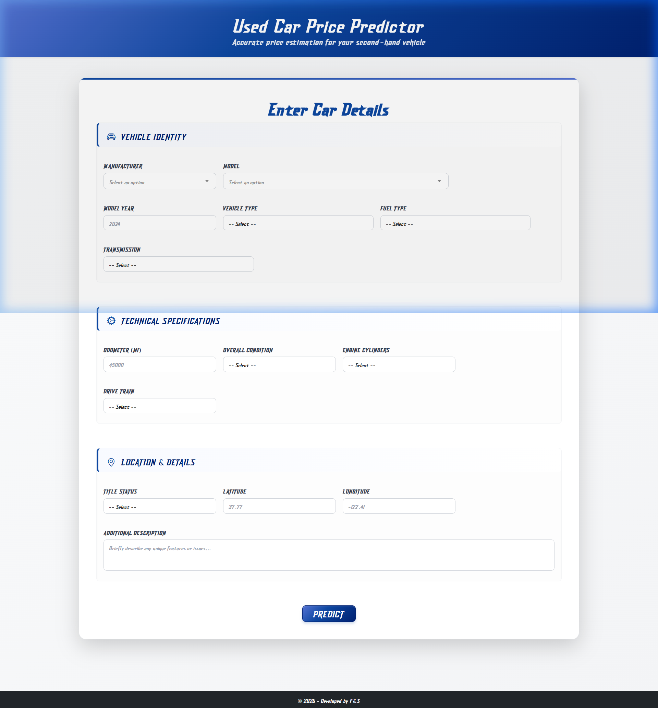

# Used Car Price Prediction

A machine learning-powered web application that predicts used car prices based on various vehicle characteristics. Built with ASP.NET Core and Python machine learning models, featuring a **premium automotive-inspired UI**.



## 🚗 Overview

This application uses advanced machine learning algorithms to predict used car prices by analyzing multiple factors including:

- Vehicle make and model
- Year and mileage (odometer reading)
- Condition and engine specifications
- Fuel type and transmission
- Geographic location (latitude/longitude)
- Vehicle type and title status
- Free-text description (processed via TF-IDF)

## 🛠️ Technology Stack

- **Frontend**: ASP.NET Core MVC with Razor Pages
- **Backend**: C# .NET 8.0
- **Machine Learning**: Python 3.13.x with scikit-learn, XGBoost, LightGBM, CatBoost
- **UI Framework**: Bootstrap 5 with custom **Glossy Royal Navy Blue** theme
- **Typography**: **Dash Horizon** (custom display font) and **Outfit** (base font)
- **JavaScript**: Vanilla JS with Select2 for enhanced dropdowns
- **Containerization**: Docker (Linux, port 8080)

## 📋 Prerequisites

Before running this project, ensure you have the following installed:

- **Python 3.13.x** (Global environment - **Required** for Windows)
- **.NET 8.0 SDK** or later
- **Visual Studio 2022** (recommended) or **Visual Studio Code**
- **Git** (for cloning the repository)

### Python Dependencies

The following Python packages are required and are automatically installed via `requirements.txt` into a virtual environment (`venv`) on first run (Windows only):

| Package | Version |
|---|---|
| catboost | 1.2.8 |
| category_encoders | 2.8.1 |
| dill | 0.4.0 |
| joblib | 1.5.1 |
| lightgbm | 4.6.0 |
| numpy | 2.3.2 |
| optuna | 4.4.0 |
| pandas | 2.3.1 |
| scikit-learn | 1.7.1 |
| scipy | 1.16.1 |
| xgboost | 3.0.4 |

> In Docker (Linux), packages are installed globally during the image build — no virtual environment is created.

## 🚀 Getting Started

### Method 1: Using Visual Studio

1. **Clone the repository**

   ```bash
   git clone <repository-url>
   cd UsedCarPricePrediction
   ```

2. **Restore .NET dependencies** (from the solution root)

   ```bash
   dotnet restore
   ```

3. **Install Python dependencies** (one-time, from the solution root)

   ```bash
   pip install -r Services/ServiceUtilities/requirements.txt
   ```

   > On Windows, these are also auto-installed into a `venv` on first run. This manual step ensures packages are available for development/testing outside the app.

4. **Open the solution**

   - Open `UsedCarPricePrediction.sln` in Visual Studio
   - Ensure Python 3.13.x is installed globally and added to PATH

5. **Build and Run**

   - Press `F5` or click "Start Debugging"
   - The application will launch in your default browser at `http://localhost:5267`

### Method 2: Using Command Line

> **Folder structure note**: When you clone the repo, by default a folder named `UsedCarPricePrediction` is created. Inside it there is a **subfolder also named `UsedCarPricePrediction`** — that inner folder is the web application project. The outer folder is the solution root.
>
> ```
> UsedCarPricePrediction/          ← solution root (repo root)
> ├── UsedCarPricePrediction/      ← web app project (cd here to run)
> ├── Services/
> ├── DataModels/
> └── ...
> ```

1. **Clone the repository** (creates the solution root folder)

   ```bash
   git clone https://github.com/fbanabil/UsedCarPricePrediction
   ```

   Or clone into an existing folder:
   ```bash
   git clone https://github.com/fbanabil/UsedCarPricePrediction .
   ```

2. **Restore .NET dependencies** — run from the **solution root** (where `UsedCarPricePrediction.sln` lives)

   ```bash
   dotnet restore
   ```

3. **Install Python dependencies** — run from the **solution root**

   ```bash
   pip install -r Services/ServiceUtilities/requirements.txt
   ```

   > On Windows, these are also auto-installed into a `venv` on first run. This manual step ensures packages are available for development/testing outside the app.

4. **Navigate into the web project subfolder and run**

   ```bash
   cd UsedCarPricePrediction       # this is the inner web project folder, not the solution root
   dotnet run
   ```

5. **Access the application**

   - Open your browser and navigate to `http://localhost:5267` (as defined in `Properties/launchSettings.json`)

### Method 3: Using Docker

1. **Build the Docker image**

   ```bash
   docker build -f UsedCarPricePrediction/Dockerfile -t used-car-predictor .
   ```
2. **Run the container**

   ```bash
   docker run -p 8080:8080 used-car-predictor
   ```
3. **Access the application**

   - Open your browser and navigate to `http://localhost:8080`

> **Note**: On Linux/Docker, Python venv setup is skipped — packages are installed globally during image build.

## 📁 Project Structure

```
UsedCarPricePrediction/
├── UsedCarPricePrediction.sln          # Solution file
├── README.md                           # This file
├── DataModels/                         # Data transfer objects and enums
│   └── Dtos/
│       ├── PredictionInputs.cs
│       ├── PredictionResult.cs
│       └── ResultJson.cs
│   └── Enums/                          # Enum types for car attributes
├── Services/                           # Business logic layer
│   ├── UsedCarPricePredictionService.cs
│   └── ServiceUtilities/
│       ├── PythonRunner.cs             # Runs Python scripts as sub-process
│       ├── InitialPythonEnviromentSetup.cs  # Sets up venv on Windows
│       ├── car_price_inference.py      # ML inference logic
│       ├── predict_car_price.py        # Python entry point (stdin → stdout JSON)
│       ├── requirements.txt            # Pinned Python dependencies
│       └── ML_Models/                  # Pre-trained ML model files (.pkl)
│           ├── best_cat_model.pkl
│           ├── best_lgb_model.pkl
│           ├── best_xgb_model.pkl
│           ├── meta_model.pkl
│           ├── boxcox_lambda.pkl
│           ├── cat_imputer.pkl
│           ├── column_preprocessor.pkl
│           ├── geo_kmeans.pkl
│           ├── num_imputer.pkl
│           ├── power_transformers.pkl
│           ├── target_encoder.pkl
│           └── tfidf_vectorizer.pkl
├── ServicInterfaces/                   # Service contracts (note: folder name typo)
│   └── IUsedCarPricePredictionService.cs
└── UsedCarPricePrediction/            # Web application
    ├── Controllers/
    │   └── HomeController.cs
    ├── Views/
    │   └── Home/
    │       └── Index.cshtml            # Main prediction form
    ├── Properties/
    │   └── launchSettings.json         # Port 5267 (http), 8080 (Docker)
    ├── Dockerfile                      # Multi-stage Docker build
    ├── wwwroot/                        # Static assets
    ├── appsettings.json
    └── Program.cs                      # Application entry point
```

## 🎯 Features

### Core Functionality

- **Machine Learning Prediction**: Ensemble of CatBoost, LightGBM, and XGBoost with a meta-model stacker
- **Premium Automotive UI**: Modern, responsive interface with a high-end Glossy Royal Navy Blue theme and race-inspired typography
- **Real-time Validation**: Client-side form validation with professional error handling
- **Geographic Awareness**: Location-based price adjustments using latitude/longitude and K-Means geo-clustering
- **NLP Feature**: Free-text vehicle description is processed via TF-IDF vectorizer

### User Interface

- **Responsive Design**: Works seamlessly on desktop, tablet, and mobile devices
- **Enhanced Dropdowns**: Select2 integration with custom typography and spacing
- **Custom Typography**: Integrated **Dash Horizon** for a bold, aggressive automotive feel with optimized letter-spacing
- **Loading Indicators**: Professional loading animations during prediction
- **Error Handling**: Contextual error messages with professional styling

### Technical Features

- **Ensemble Learning**: Combines CatBoost, LightGBM, and XGBoost predictions using a meta-model for stacking
- **Robust Path Resolution**: Dynamically calculates the solution root to reliably locate Python utilities and ML models
- **Data Preprocessing**: Automated feature engineering and data transformation
- **Model Persistence**: 12 pre-trained `.pkl` model files for fast prediction response
- **Cross-platform**: Runs natively on Windows (with Python venv) and in Docker (Linux, global packages)
- **Python Isolation**: On Windows, a `venv` virtual environment is created automatically on first launch

## 📊 Machine Learning Models

The application uses an ensemble stacking approach with these pre-trained models:

1. **CatBoost** (`best_cat_model.pkl`): Gradient boosting with native categorical feature support
2. **LightGBM** (`best_lgb_model.pkl`): Fast gradient boosting framework
3. **XGBoost** (`best_xgb_model.pkl`): Extreme gradient boosting
4. **Meta-model** (`meta_model.pkl`): Combines base model predictions (stacking)

### Supporting Artifacts

- `boxcox_lambda.pkl` — Box-Cox power transformation parameters
- `cat_imputer.pkl` — Categorical feature imputer
- `num_imputer.pkl` — Numerical feature imputer
- `column_preprocessor.pkl` — Column-level feature preprocessing pipeline
- `geo_kmeans.pkl` — K-Means model for geographic clustering
- `power_transformers.pkl` — Power transformations for skewed features
- `target_encoder.pkl` — Target encoding for categorical features
- `tfidf_vectorizer.pkl` — TF-IDF vectorizer for vehicle description text

## 🔧 Configuration

### Python Environment (Windows)

On Windows, a `venv` virtual environment is automatically created inside `Services/ServiceUtilities/` on first startup. Ensure Python 3.13.x is installed and accessible globally:

```bash
python --version  # Should output: Python 3.13.x
```

### Application Settings

- `appsettings.json`: Production log level and host settings
- `appsettings.Development.json`: Development log level overrides
- `Properties/launchSettings.json`: Port and launch profile configuration

### Port Reference

| Launch Method | Port |
|---|---|
| `dotnet run` / Visual Studio (http profile) | 5267 |
| IIS Express | 54566 |
| Docker | 8080 |

## 🐛 Troubleshooting

### Common Issues

1. **Python not found / venv setup fails**

   - Ensure Python 3.13.x is installed globally and added to your system PATH
   - The app will return a plain-text 500 error on startup if venv setup fails

2. **Port already in use**

   - Edit `Properties/launchSettings.json` to change `applicationUrl`

3. **Model loading errors**

   - Ensure all 12 `.pkl` files are present in `Services/ServiceUtilities/ML_Models/`
   - Ensure the virtual environment has all required packages installed

4. **Could not determine solution root directory**

   - This error comes from `UsedCarPricePredictionService.cs` — ensure you run `dotnet run` from the `UsedCarPricePrediction/` web project folder, not the solution root

### Development Tips

- Use Visual Studio's debugging features for C# code
- Check browser console for JavaScript errors
- Monitor the terminal output for Python script execution logs (the C# layer logs Python stdout/stderr)

## 🐳 Docker Notes

- The Dockerfile uses a multi-stage build: `base` → `build` → `publish` → `final`
- Python packages are installed directly (no venv) using `pip3 --break-system-packages`
- The app skips `EnsureEnvironment()` entirely when running on Linux/Docker
- Container exposes port `8080`

## 🤝 Contributing

1. Fork the repository
2. Create a feature branch (`git checkout -b feature/AmazingFeature`)
3. Commit your changes (`git commit -m 'Add some AmazingFeature'`)
4. Push to the branch (`git push origin feature/AmazingFeature`)
5. Open a Pull Request

📞 Support

For support, please open an issue in the GitHub repository or contact the development team.

**Happy Predicting! 🚗💰**
